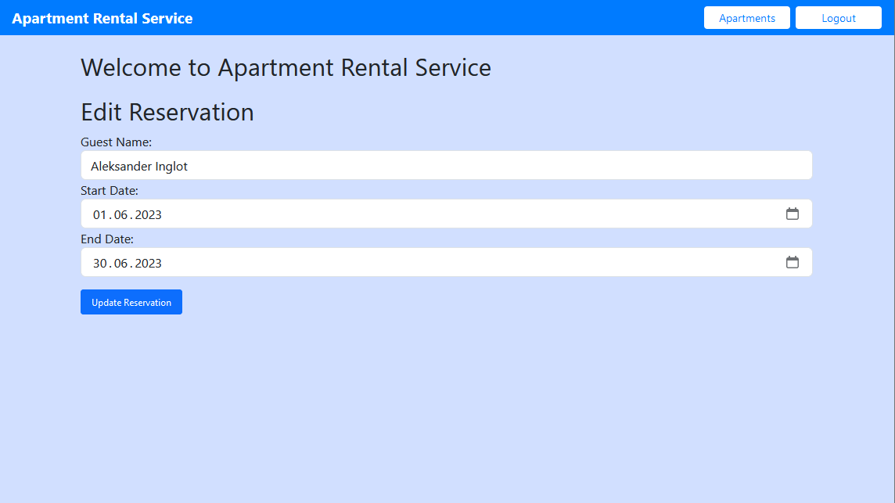

# Microservices - Apartment Rental Service

Apartment Rental Service is a web application developed using Spring Boot. It allows users to register, log in, list apartments for rent, rent an apartment for a specific range of dates, and edit their bookings. It also sends notifications to the guest email after making or updating reservation.

## Features
The application provides the  REST methods and services for managing apartments and bookings:
- User registration and login: New users can create an account and log in.
- List Apartment: Registered users can see a list of apartments for rent.
- Rent Apartment: Registered users can rent an apartment for a specific period.
- Edit Booking: Users can edit their booking details or delete the booking.
- Add Apartment: User with admin role can add new apartments.

It also contains a separate microservice to send notification emails.

## Technologies Used

- Java
- Spring core / Spring Data JPA / Spring web / Spring security / Spring cloud
- Maven
- MySQL
- JSON Web Token
- Angular (front-end part)
- Docker / Docker Compose

## Screenshots

  
  
 
  
 
  

